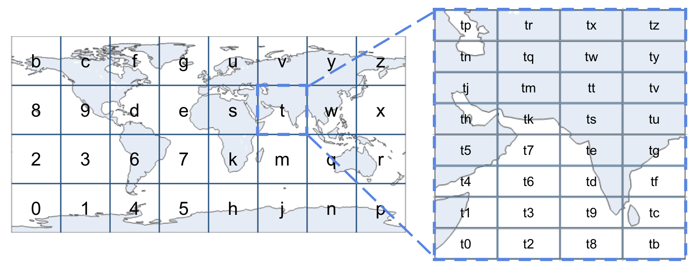

# What is a Geohash?

A geohash is a string representation of a geographic location, encoded as a series of characters. This encoding allows for efficient storage and querying of spatial data. Geohashes are hierarchical, meaning that as the string length increases, the represented area becomes more precise.

## How Geohashes Work

Geohashes divide the world into a grid of cells, each with a unique identifier (encoded in base32). The precision of the geohash can be adjusted by changing its length:

- Short geohashes represent larger areas.
- Long geohashes represent smaller, more precise areas.

| Geohash Length | Lat Bits | Lng Bits | Lat Error | Lng Error | Km Error                   |
| -------------- | -------- | -------- | --------- | --------- | -------------------------- |
| 1              | 2        | 3        | ±23       | ±23       | ±2,500 km (1,600 mi)       |
| 2              | 5        | 5        | ±2.8      | ±5.6      | ±630 km (390 mi)           |
| 3              | 7        | 8        | ±0.70     | ±0.70     | ±78 km (48 mi)             |
| 4              | 10       | 10       | ±0.087    | ±0.18     | ±20 km (12 mi)             |
| 5              | 12       | 13       | ±0.022    | ±0.022    | ±2.4 km (1.5 mi; 2,400 m)  |
| 6              | 15       | 15       | ±0.0027   | ±0.0055   | ±0.61 km (0.38 mi; 610 m)  |
| 7              | 17       | 18       | ±0.00068  | ±0.00068  | ±0.076 km (0.047 mi; 76 m) |
| 8              | 20       | 20       | ±0.000085 | ±0.00017  | ±0.019 km (0.012 mi; 19 m) |

For example, the following geohashes are all within a maximum distance of +/- 78km (48mi) from each other:

- **s00**8nb00j8
- **s00**twy01mt
- **s00**j8n012j

However, these geohashes represent completely different regions:

- **s12**8nb00j8
- **s34**twy01mt
- **s56**j8n012j

## Benefits of Using Geohashes

- **Compact Representation**: Efficiently stores geographic coordinates.
- **Hierarchical Structure**: Allows for easy aggregation and precision adjustment.
- **Proximity Queries**: Simplifies the process of finding nearby locations.
