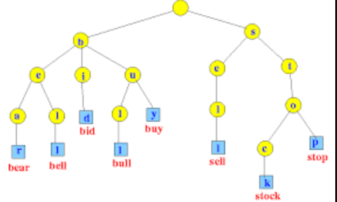
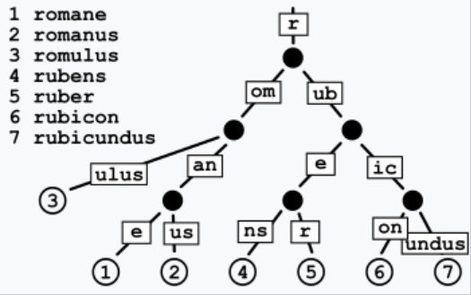

# Prefix Searching

## What is Prefix Search?

Prefix search is a method for quickly finding all entries in a dataset that share a common prefix. In the context of geohashes, it allows us to retrieve all geohashes that start with the same characters, which is useful for geographical proximity searches.

## Trie Tree

We can store Geohashes in a Trie Tree data structure. Tries enable us to efficiently retrieve geohashes with a common prefix in O(L) time, where L is the length of the prefix being searched.

### Key Features of Trie Tree:

- **Efficient Retrieval:** Quickly find geohashes sharing a common prefix.
- **Time Complexity:** `O(L)`, where `L` is the prefix length.

## Patricia Trie Tree

A Patricia Trie Tree, also known as a Radix Tree, is a type of Trie Tree that optimizes space by merging common prefixes into single nodes. This further enhances the efficiency of prefix searching by reducing the number of nodes.

### Key Features of Patricia Trie Tree:

- **Space Optimization:** Merges common prefixes to save space.
- **Efficient Lookup:** Retrieves geohashes with common prefixes efficiently.
- **Time Complexity:** Best case `O(log N)` where `N` is the length of the longest geohash stored, and worst case `O(L)` where `L` is the length of the prefix.

## Comparisons

### Skip List

A [Skip List](https://en.wikipedia.org/wiki/Skip_list) is a probabilistic data structure that allows for fast search, insertion, and deletion operations. It consists of multiple levels of linked lists, with each higher level acting as an "express lane" for elements lower down.

- **Pros:**

  - **Efficient Average-case Performance:** Provides good average-case performance for search operations, typically `O(log N)` time complexity.
  - **Cache-friendly:** The contiguous arrangement of nodes makes Skip Lists more cache-friendly than tree-based structures.

- **Cons:**
  - **Space Overhead:** Requires additional space to maintain pointers for multiple levels, resulting in higher space usage compared to a Patricia Trie.
  - **Probability Calculations:** Maintaining balance requires careful calculation of node levels' probabilities, involving some understanding of probability theory.

### B-Trees and SS-Tables

[B-Trees](https://en.wikipedia.org/wiki/B-tree) are balanced tree data structures that maintain sorted data and allow for searches, sequential access, insertions, and deletions in logarithmic time. [SS-Tables (Sorted String Tables)](https://www.mauriciopoppe.com/notes/computer-science/data-structures/memtable-sstable/) are immutable data structures often used in conjunction with B-Trees for efficient storage and retrieval of key-value pairs.

- **Pros:**

  - **Efficient Disk-based Storage:** Suitable for handling large datasets and are particularly effective for disk-based storage solutions.
  - **Range Queries and Sorted Data Retrieval:** Excellent for performing range queries and retrieving sorted data efficiently.

- **Cons:**
  - **Disk I/O Dependency:** Involves disk I/O operations, which can be slower for real-time updates.
  - **Less Efficient for In-memory Operations:** Compared to Patricia Trie, B-Trees and SS-Tables are less efficient for in-memory operations.

### Why Patricia Trie?

For geospatial data, where object locations might change in real-time, in-memory solutions like Patricia Trie are preferred due to their speed and efficiency in handling dynamic data without incurring the latency of disk I/O.
